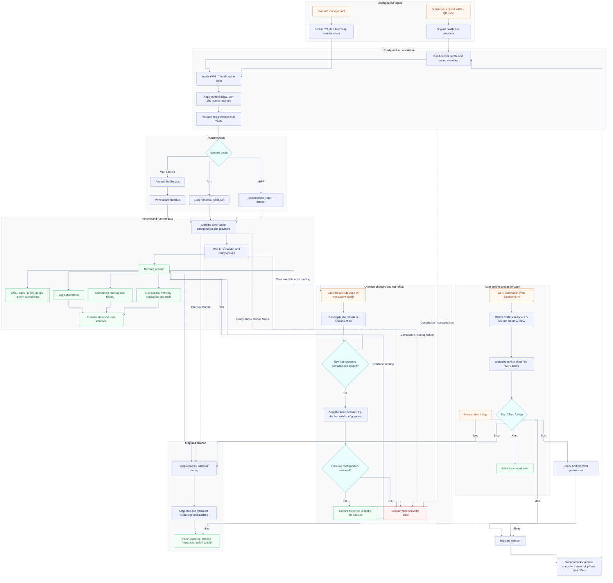

YumeBox is responsible for managing configuration, overwriting and running sessions; mihomo is responsible for parsing nodes, establishing connections and providing running data.

```mermaid
---
config:
  theme: base
  themeVariables:
    fontFamily: "Ubuntu Sans, sans-serif"
    fontSize: "16px"
    primaryColor: "#eef2ff"
    primaryTextColor: "#172554"
    primaryBorderColor: "#818cf8"
    lineColor: "#64748b"
    clusterBkg: "#f8fafc"
    clusterBorder: "#cbd5e1"
    edgeLabelBackground: "#ffffff"
  flowchart:
    curve: stepAfter
    nodeSpacing: 24
    rankSpacing: 40
---
flowchart TB
    subgraph INPUT["Configuration inputs"]
        SOURCE["Subscription / local YAML / QR code"] --> PROFILE["Original profile and providers"]
        OVERRIDE["Override management"] --> CHAIN["Built-in / YAML / JavaScript override chain"]
    end

    subgraph ACTION["User actions and automation"]
        MANUAL["Manual start / stop"]
        WIFI["Wi-Fi automation (Vpn Service only)"] --> SSID["Watch SSID; wait for a 1.5-second stable window"]
        SSID --> RULE["Matching rule or other / no Wi-Fi action"] --> AUTO{"Start / Stop / Keep"}
        AUTO -->|Keep| KEEP["Keep the current state"]
    end

    MANUAL -->|Start| SESSION["Runtime session"]
    AUTO -->|Start| PERMISSION["Check Android VPN permission"] --> SESSION
    SESSION --> CHECK["Startup checks: remote controller / state / duplicate start / Geo"]

    subgraph COMPILE["Configuration compilation"]
        READ["Read current profile and bound overrides"] --> APPLY["Apply YAML / JavaScript in order"]
        APPLY --> PATCH["Apply runtime DNS, Tun and listener patches"] --> YAML["Validate and generate final YAML"]
    end
    PROFILE --> READ
    CHAIN --> APPLY
    CHECK --> READ

    subgraph MODE["Runtime mode"]
        SELECT{"Runtime mode"}
        SELECT -->|Vpn Service| VPN["Android TunService"] --> TUNFD["VPN virtual interface"]
        SELECT -->|Tun| ROOT["Root mihomo / Root Tun"]
        SELECT -->|eBPF| EBPF["Root mihomo / eBPF listener"]
    end
    YAML --> SELECT

    subgraph CORE["mihomo and runtime data"]
        START["Start the core; parse configuration and providers"] --> READY["Wait for controller and policy groups"] --> RUNNING["Running session"]
        RUNNING --> PROXY["DNS / rules / proxy groups / proxy connections"]
        RUNNING --> LOG["Log subscription"] --> UI["Runtime state and user interface"]
        RUNNING --> CONNECTIONS["Connection tracking and history"] --> UI
        RUNNING --> TRAFFIC["Live speed / traffic by application and route"] --> UI
    end
    TUNFD --> START
    ROOT --> START
    EBPF --> START

    subgraph RELOAD["Override changes and hot reload"]
        SAVE["Save an override used by the current profile"] --> RECOMPILE["Recompile the complete override chain"]
        RECOMPILE --> LOADED{"New configuration compiled and loaded?"}
        LOADED -->|No| RESTORE["Stop the failed session; try the last valid configuration"] --> RESTORED{"Previous configuration restored?"}
        RESTORED -->|Yes| OLD["Record the error; keep the old session"]
        RESTORED -->|No| FAILED["Session fails; show the error"]
    end
    RUNNING -->|Save override while running| SAVE
    LOADED -->|Yes| RUNNING
    OLD -->|Continue running| RUNNING

    subgraph CLEANUP["Stop and cleanup"]
        STOP["Stop request / interrupt startup"] --> CLOSE["Stop core and transport; close logs and tracking"] --> IDLE["Flush statistics; release resources; return to Idle"]
    end
    MANUAL -->|Stop| STOP
    AUTO -->|Stop| STOP
    RUNNING --> STOP
    START -.->|Interrupt startup| STOP
    COMPILE -.->|Compilation / startup failure| FAILED
    START -.->|Compilation / startup failure| FAILED
    READY -.->|Compilation / startup failure| FAILED
    FAILED -.->|Retry| SESSION
    FAILED -->|Exit| IDLE

    classDef input fill:#fff7ed,stroke:#f97316,color:#9a3412;
    classDef process fill:#eef2ff,stroke:#818cf8,color:#172554;
    classDef decision fill:#ecfeff,stroke:#0891b2,color:#164e63;
    classDef result fill:#f0fdf4,stroke:#22c55e,color:#166534;
    classDef error fill:#fef2f2,stroke:#ef4444,color:#991b1b;
    class SOURCE,OVERRIDE,MANUAL,WIFI,SAVE input;
    class PROFILE,CHAIN,SSID,RULE,PERMISSION,SESSION,CHECK,READ,APPLY,PATCH,YAML,VPN,TUNFD,ROOT,EBPF,START,READY,RECOMPILE,RESTORE,CLOSE process;
    class AUTO,SELECT,LOADED,RESTORED decision;
    class KEEP,RUNNING,PROXY,LOG,CONNECTIONS,TRAFFIC,UI,OLD,IDLE result;
    class FAILED error;
```
