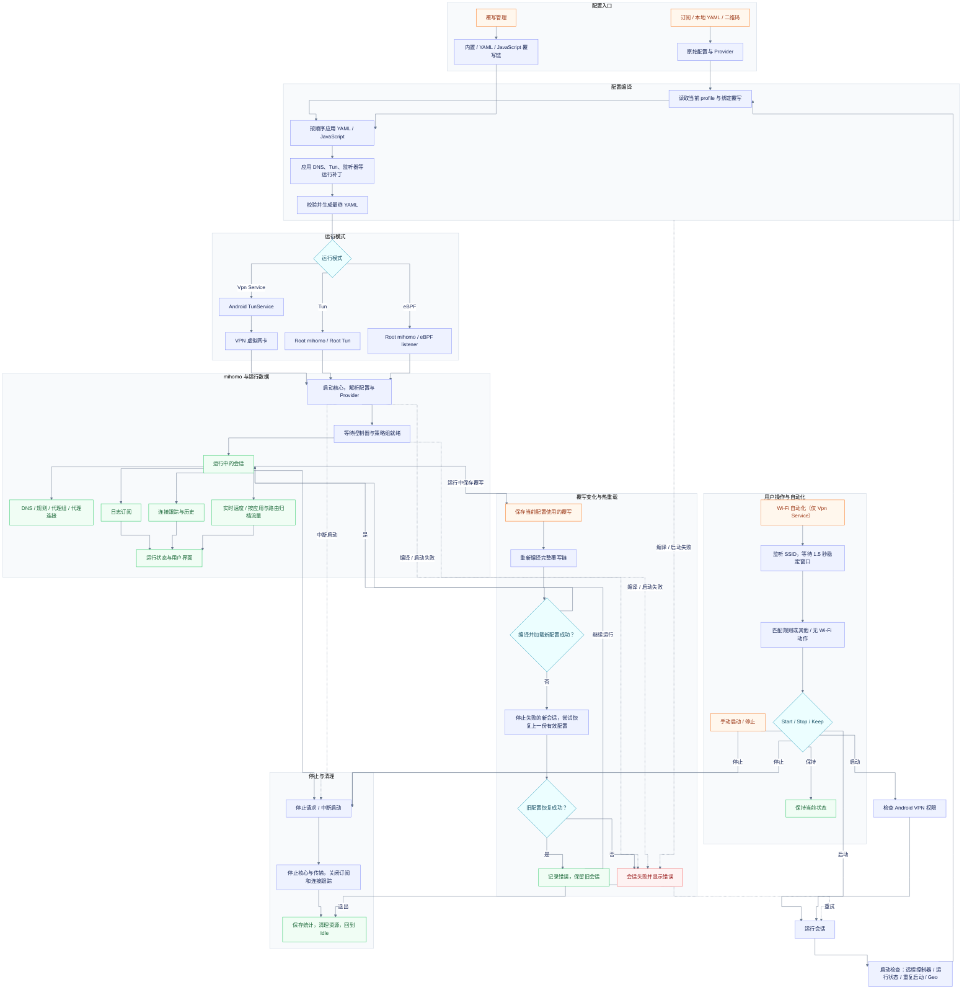

YumeBox 负责管理配置、覆写和运行会话；mihomo 负责解析节点、建立连接并提供运行数据。

```mermaid
---
config:
  theme: base
  themeVariables:
    fontFamily: "Ubuntu Sans, sans-serif"
    fontSize: "16px"
    primaryColor: "#eef2ff"
    primaryTextColor: "#172554"
    primaryBorderColor: "#818cf8"
    lineColor: "#64748b"
    clusterBkg: "#f8fafc"
    clusterBorder: "#cbd5e1"
    edgeLabelBackground: "#ffffff"
  flowchart:
    curve: stepAfter
    nodeSpacing: 24
    rankSpacing: 40
---
flowchart TB
    subgraph INPUT["配置入口"]
        SOURCE["订阅 / 本地 YAML / 二维码"] --> PROFILE["原始配置与 Provider"]
        OVERRIDE["覆写管理"] --> CHAIN["内置 / YAML / JavaScript 覆写链"]
    end

    subgraph ACTION["用户操作与自动化"]
        MANUAL["手动启动 / 停止"]
        WIFI["Wi-Fi 自动化（仅 Vpn Service）"] --> SSID["监听 SSID，等待 1.5 秒稳定窗口"]
        SSID --> RULE["匹配规则或其他 / 无 Wi-Fi 动作"] --> AUTO{"Start / Stop / Keep"}
        AUTO -->|保持| KEEP["保持当前状态"]
    end

    MANUAL -->|启动| SESSION["运行会话"]
    AUTO -->|启动| PERMISSION["检查 Android VPN 权限"] --> SESSION
    SESSION --> CHECK["启动检查：远程控制器 / 运行状态 / 重复启动 / Geo"]

    subgraph COMPILE["配置编译"]
        READ["读取当前 profile 与绑定覆写"] --> APPLY["按顺序应用 YAML / JavaScript"]
        APPLY --> PATCH["应用 DNS、Tun、监听器等运行补丁"] --> YAML["校验并生成最终 YAML"]
    end
    PROFILE --> READ
    CHAIN --> APPLY
    CHECK --> READ

    subgraph MODE["运行模式"]
        SELECT{"运行模式"}
        SELECT -->|Vpn Service| VPN["Android TunService"] --> TUNFD["VPN 虚拟网卡"]
        SELECT -->|Tun| ROOT["Root mihomo / Root Tun"]
        SELECT -->|eBPF| EBPF["Root mihomo / eBPF listener"]
    end
    YAML --> SELECT

    subgraph CORE["mihomo 与运行数据"]
        START["启动核心，解析配置与 Provider"] --> READY["等待控制器与策略组就绪"] --> RUNNING["运行中的会话"]
        RUNNING --> PROXY["DNS / 规则 / 代理组 / 代理连接"]
        RUNNING --> LOG["日志订阅"] --> UI["运行状态与用户界面"]
        RUNNING --> CONNECTIONS["连接跟踪与历史"] --> UI
        RUNNING --> TRAFFIC["实时速度 / 按应用与路由归档流量"] --> UI
    end
    TUNFD --> START
    ROOT --> START
    EBPF --> START

    subgraph RELOAD["覆写变化与热重载"]
        SAVE["保存当前配置使用的覆写"] --> RECOMPILE["重新编译完整覆写链"]
        RECOMPILE --> LOADED{"编译并加载新配置成功？"}
        LOADED -->|否| RESTORE["停止失败的新会话，尝试恢复上一份有效配置"] --> RESTORED{"旧配置恢复成功？"}
        RESTORED -->|是| OLD["记录错误，保留旧会话"]
        RESTORED -->|否| FAILED["会话失败并显示错误"]
    end
    RUNNING -->|运行中保存覆写| SAVE
    LOADED -->|是| RUNNING
    OLD -->|继续运行| RUNNING

    subgraph CLEANUP["停止与清理"]
        STOP["停止请求 / 中断启动"] --> CLOSE["停止核心与传输，关闭订阅和连接跟踪"] --> IDLE["保存统计，清理资源，回到 Idle"]
    end
    MANUAL -->|停止| STOP
    AUTO -->|停止| STOP
    RUNNING --> STOP
    START -.->|中断启动| STOP
    COMPILE -.->|编译 / 启动失败| FAILED
    START -.->|编译 / 启动失败| FAILED
    READY -.->|编译 / 启动失败| FAILED
    FAILED -.->|重试| SESSION
    FAILED -->|退出| IDLE

    classDef input fill:#fff7ed,stroke:#f97316,color:#9a3412;
    classDef process fill:#eef2ff,stroke:#818cf8,color:#172554;
    classDef decision fill:#ecfeff,stroke:#0891b2,color:#164e63;
    classDef result fill:#f0fdf4,stroke:#22c55e,color:#166534;
    classDef error fill:#fef2f2,stroke:#ef4444,color:#991b1b;
    class SOURCE,OVERRIDE,MANUAL,WIFI,SAVE input;
    class PROFILE,CHAIN,SSID,RULE,PERMISSION,SESSION,CHECK,READ,APPLY,PATCH,YAML,VPN,TUNFD,ROOT,EBPF,START,READY,RECOMPILE,RESTORE,CLOSE process;
    class AUTO,SELECT,LOADED,RESTORED decision;
    class KEEP,RUNNING,PROXY,LOG,CONNECTIONS,TRAFFIC,UI,OLD,IDLE result;
    class FAILED error;
```
