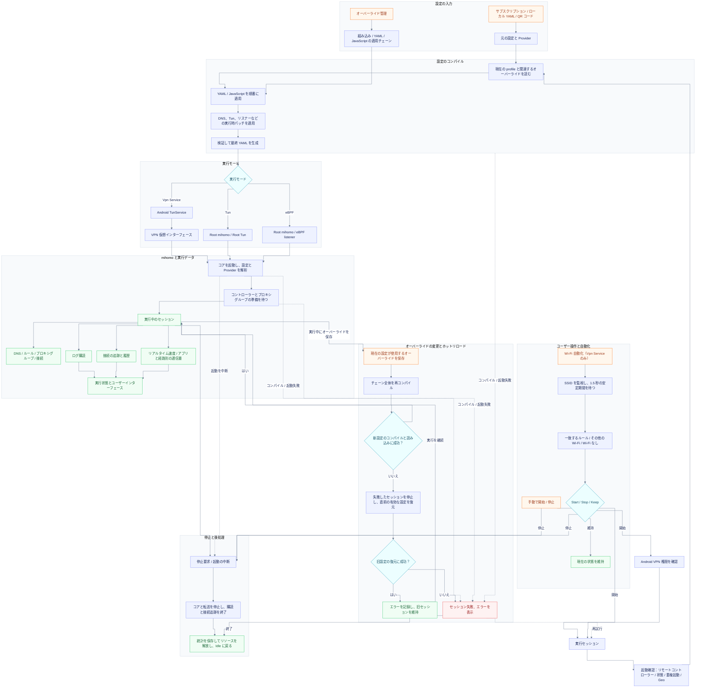

YumeBox は、構成の管理、オーバーライド、セッションの実行を担当します。mihomo は、ノードの解析、接続の確立、実行データの提供を担当します。

```mermaid
---
config:
  theme: base
  themeVariables:
    fontFamily: "Ubuntu Sans, sans-serif"
    fontSize: "16px"
    primaryColor: "#eef2ff"
    primaryTextColor: "#172554"
    primaryBorderColor: "#818cf8"
    lineColor: "#64748b"
    clusterBkg: "#f8fafc"
    clusterBorder: "#cbd5e1"
    edgeLabelBackground: "#ffffff"
  flowchart:
    curve: stepAfter
    nodeSpacing: 24
    rankSpacing: 40
---
flowchart TB
    subgraph INPUT["設定の入力"]
        SOURCE["サブスクリプション / ローカル YAML / QR コード"] --> PROFILE["元の設定と Provider"]
        OVERRIDE["オーバーライド管理"] --> CHAIN["組み込み / YAML / JavaScript の適用チェーン"]
    end

    subgraph ACTION["ユーザー操作と自動化"]
        MANUAL["手動で開始 / 停止"]
        WIFI["Wi-Fi 自動化（Vpn Service のみ）"] --> SSID["SSID を監視し、1.5 秒の安定期間を待つ"]
        SSID --> RULE["一致するルール / その他の Wi-Fi / Wi-Fi なし"] --> AUTO{"Start / Stop / Keep"}
        AUTO -->|維持| KEEP["現在の状態を維持"]
    end

    MANUAL -->|開始| SESSION["実行セッション"]
    AUTO -->|開始| PERMISSION["Android VPN 権限を確認"] --> SESSION
    SESSION --> CHECK["起動確認：リモートコントローラー / 状態 / 重複起動 / Geo"]

    subgraph COMPILE["設定のコンパイル"]
        READ["現在の profile と関連するオーバーライドを読む"] --> APPLY["YAML / JavaScript を順番に適用"]
        APPLY --> PATCH["DNS、Tun、リスナーなどの実行時パッチを適用"] --> YAML["検証して最終 YAML を生成"]
    end
    PROFILE --> READ
    CHAIN --> APPLY
    CHECK --> READ

    subgraph MODE["実行モード"]
        SELECT{"実行モード"}
        SELECT -->|Vpn Service| VPN["Android TunService"] --> TUNFD["VPN 仮想インターフェース"]
        SELECT -->|Tun| ROOT["Root mihomo / Root Tun"]
        SELECT -->|eBPF| EBPF["Root mihomo / eBPF listener"]
    end
    YAML --> SELECT

    subgraph CORE["mihomo と実行データ"]
        START["コアを起動し、設定と Provider を解析"] --> READY["コントローラーとプロキシグループの準備を待つ"] --> RUNNING["実行中のセッション"]
        RUNNING --> PROXY["DNS / ルール / プロキシグループ / 接続"]
        RUNNING --> LOG["ログ購読"] --> UI["実行状態とユーザーインターフェース"]
        RUNNING --> CONNECTIONS["接続の追跡と履歴"] --> UI
        RUNNING --> TRAFFIC["リアルタイム速度 / アプリと経路別の通信量"] --> UI
    end
    TUNFD --> START
    ROOT --> START
    EBPF --> START

    subgraph RELOAD["オーバーライドの変更とホットリロード"]
        SAVE["現在の設定が使用するオーバーライドを保存"] --> RECOMPILE["チェーン全体を再コンパイル"]
        RECOMPILE --> LOADED{"新設定のコンパイルと読み込みに成功？"}
        LOADED -->|いいえ| RESTORE["失敗したセッションを停止し、直前の有効な設定を復元"] --> RESTORED{"旧設定の復元に成功？"}
        RESTORED -->|はい| OLD["エラーを記録し、旧セッションを維持"]
        RESTORED -->|いいえ| FAILED["セッション失敗、エラーを表示"]
    end
    RUNNING -->|実行中にオーバーライドを保存| SAVE
    LOADED -->|はい| RUNNING
    OLD -->|実行を継続| RUNNING

    subgraph CLEANUP["停止と後処理"]
        STOP["停止要求 / 起動の中断"] --> CLOSE["コアと転送を停止し、購読と接続追跡を終了"] --> IDLE["統計を保存してリソースを解放し、Idle に戻る"]
    end
    MANUAL -->|停止| STOP
    AUTO -->|停止| STOP
    RUNNING --> STOP
    START -.->|起動を中断| STOP
    COMPILE -.->|コンパイル / 起動失敗| FAILED
    START -.->|コンパイル / 起動失敗| FAILED
    READY -.->|コンパイル / 起動失敗| FAILED
    FAILED -.->|再試行| SESSION
    FAILED -->|終了| IDLE

    classDef input fill:#fff7ed,stroke:#f97316,color:#9a3412;
    classDef process fill:#eef2ff,stroke:#818cf8,color:#172554;
    classDef decision fill:#ecfeff,stroke:#0891b2,color:#164e63;
    classDef result fill:#f0fdf4,stroke:#22c55e,color:#166534;
    classDef error fill:#fef2f2,stroke:#ef4444,color:#991b1b;
    class SOURCE,OVERRIDE,MANUAL,WIFI,SAVE input;
    class PROFILE,CHAIN,SSID,RULE,PERMISSION,SESSION,CHECK,READ,APPLY,PATCH,YAML,VPN,TUNFD,ROOT,EBPF,START,READY,RECOMPILE,RESTORE,CLOSE process;
    class AUTO,SELECT,LOADED,RESTORED decision;
    class KEEP,RUNNING,PROXY,LOG,CONNECTIONS,TRAFFIC,UI,OLD,IDLE result;
    class FAILED error;
```
