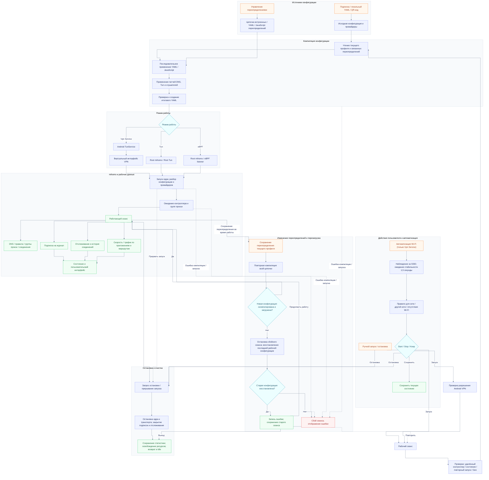

YumeBox отвечает за управление конфигурацией, перезаписью и запуском сеансов; mihomo отвечает за анализ узлов, установление соединений и предоставление текущих данных.

```mermaid
---
config:
  theme: base
  themeVariables:
    fontFamily: "Ubuntu Sans, sans-serif"
    fontSize: "16px"
    primaryColor: "#eef2ff"
    primaryTextColor: "#172554"
    primaryBorderColor: "#818cf8"
    lineColor: "#64748b"
    clusterBkg: "#f8fafc"
    clusterBorder: "#cbd5e1"
    edgeLabelBackground: "#ffffff"
  flowchart:
    curve: stepAfter
    nodeSpacing: 24
    rankSpacing: 40
---
flowchart TB
    subgraph INPUT["Источники конфигурации"]
        SOURCE["Подписка / локальный YAML / QR-код"] --> PROFILE["Исходная конфигурация и провайдеры"]
        OVERRIDE["Управление переопределениями"] --> CHAIN["Цепочка встроенных / YAML / JavaScript переопределений"]
    end

    subgraph ACTION["Действия пользователя и автоматизация"]
        MANUAL["Ручной запуск / остановка"]
        WIFI["Автоматизация Wi-Fi (только Vpn Service)"] --> SSID["Наблюдение за SSID; ожидание стабильности 1,5 секунды"]
        SSID --> RULE["Правило для сети / другой сети / отсутствия Wi-Fi"] --> AUTO{"Start / Stop / Keep"}
        AUTO -->|Сохранить| KEEP["Сохранить текущее состояние"]
    end

    MANUAL -->|Запуск| SESSION["Рабочий сеанс"]
    AUTO -->|Запуск| PERMISSION["Проверка разрешения Android VPN"] --> SESSION
    SESSION --> CHECK["Проверки: удалённый контроллер / состояние / повторный запуск / Geo"]

    subgraph COMPILE["Компиляция конфигурации"]
        READ["Чтение текущего профиля и связанных переопределений"] --> APPLY["Последовательное применение YAML / JavaScript"]
        APPLY --> PATCH["Применение патчей DNS, Tun и слушателей"] --> YAML["Проверка и создание итогового YAML"]
    end
    PROFILE --> READ
    CHAIN --> APPLY
    CHECK --> READ

    subgraph MODE["Режим работы"]
        SELECT{"Режим работы"}
        SELECT -->|Vpn Service| VPN["Android TunService"] --> TUNFD["Виртуальный интерфейс VPN"]
        SELECT -->|Tun| ROOT["Root mihomo / Root Tun"]
        SELECT -->|eBPF| EBPF["Root mihomo / eBPF listener"]
    end
    YAML --> SELECT

    subgraph CORE["mihomo и рабочие данные"]
        START["Запуск ядра; разбор конфигурации и провайдеров"] --> READY["Ожидание контроллера и групп прокси"] --> RUNNING["Работающий сеанс"]
        RUNNING --> PROXY["DNS / правила / группы прокси / соединения"]
        RUNNING --> LOG["Подписка на журнал"] --> UI["Состояние и пользовательский интерфейс"]
        RUNNING --> CONNECTIONS["Отслеживание и история соединений"] --> UI
        RUNNING --> TRAFFIC["Скорость / трафик по приложениям и маршрутам"] --> UI
    end
    TUNFD --> START
    ROOT --> START
    EBPF --> START

    subgraph RELOAD["Изменение переопределений и перезагрузка"]
        SAVE["Сохранение переопределения текущего профиля"] --> RECOMPILE["Повторная компиляция всей цепочки"]
        RECOMPILE --> LOADED{"Новая конфигурация скомпилирована и загружена?"}
        LOADED -->|Нет| RESTORE["Остановка сбойного сеанса; восстановление последней рабочей конфигурации"] --> RESTORED{"Старая конфигурация восстановлена?"}
        RESTORED -->|Да| OLD["Запись ошибки; сохранение старого сеанса"]
        RESTORED -->|Нет| FAILED["Сбой сеанса; отображение ошибки"]
    end
    RUNNING -->|Сохранение переопределения во время работы| SAVE
    LOADED -->|Да| RUNNING
    OLD -->|Продолжить работу| RUNNING

    subgraph CLEANUP["Остановка и очистка"]
        STOP["Запрос остановки / прерывание запуска"] --> CLOSE["Остановка ядра и транспорта; закрытие подписок и отслеживания"] --> IDLE["Сохранение статистики; освобождение ресурсов; возврат в Idle"]
    end
    MANUAL -->|Остановка| STOP
    AUTO -->|Остановка| STOP
    RUNNING --> STOP
    START -.->|Прервать запуск| STOP
    COMPILE -.->|Ошибка компиляции / запуска| FAILED
    START -.->|Ошибка компиляции / запуска| FAILED
    READY -.->|Ошибка компиляции / запуска| FAILED
    FAILED -.->|Повторить| SESSION
    FAILED -->|Выход| IDLE

    classDef input fill:#fff7ed,stroke:#f97316,color:#9a3412;
    classDef process fill:#eef2ff,stroke:#818cf8,color:#172554;
    classDef decision fill:#ecfeff,stroke:#0891b2,color:#164e63;
    classDef result fill:#f0fdf4,stroke:#22c55e,color:#166534;
    classDef error fill:#fef2f2,stroke:#ef4444,color:#991b1b;
    class SOURCE,OVERRIDE,MANUAL,WIFI,SAVE input;
    class PROFILE,CHAIN,SSID,RULE,PERMISSION,SESSION,CHECK,READ,APPLY,PATCH,YAML,VPN,TUNFD,ROOT,EBPF,START,READY,RECOMPILE,RESTORE,CLOSE process;
    class AUTO,SELECT,LOADED,RESTORED decision;
    class KEEP,RUNNING,PROXY,LOG,CONNECTIONS,TRAFFIC,UI,OLD,IDLE result;
    class FAILED error;
```
